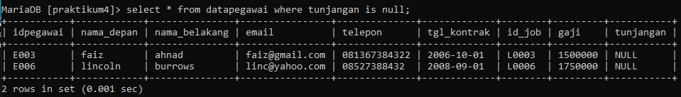
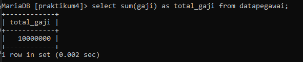
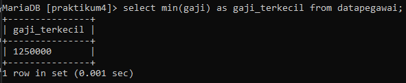

# PRAKTIKUM 4

## 4.1 TABEL PEGAWAI

1. Tampilkan pegawai yang gajinya bukan 2.000.000 dan 1.250.000 !

2. Tampilkan pegawai yang tunjangannya NULL !

3. Tampilkan pegawai yang tunjangannya NOT NULL !

4. Tampilkan / hitung jumlah baris / record tabel pegawai !

5. Tampilkan / hitung jumlah total gaji ditabel pegawai !

6. Tampilkan / hitung rata-rata gaji pegawai !

7. Tampilkan gaji terkecil !

8. Tampilkan gaji terbesar !

## 4.2 TABEL HEWAN

1. Tampilkan jumlah hewan yang dimiliki setiap owner !

b

2. Tampilkan jumlah hewan berdasarkan spesies !

b

3. Tampilkan jumlah hewan berdasarkan jenis kelamin !

b

4. Tampilkan jumlah hewan berdasarkan spesies dan jenis kelamin !

b

5. Tampilkan jumlah hewan berdasarkan spesies (cat dan dog) dan jenis kelamin !

b

6. Tampilkan jumlah hewan berdasarkan jenis kelamin yang diketahui saja !

b
